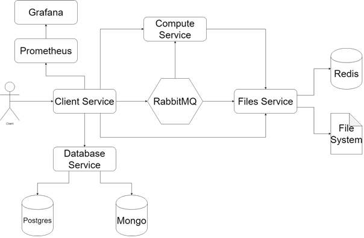

# Platformă de execuție de cod pentru temele și laboratoarele studenților ACS

## Introducere

#### 1. Context
Din experiența personală, în rezolvarea temelor și laboratoarelor din cadrul ACS pot apărea diverse probleme de configurare din cauza diferențelor dintre sistemele pe care acestea sunt dezvoltate și cele pe care sunt testate. De asemenea, de-a lungul facultații se adună multe tool-uri cerute la diverse materii pe calculatorul personal și este posibil ca unele sa nu mai fie folosite niciodată.

#### 2. Soluția propusă	
Consider că o platforma care permite dezvoltarea și testarea temelor și laboratoarelor în mediul online prezintă numeroase aventaje: nu vor exista diferențe între mediul de dezvoltare și cel de testare deoarece acestea vor fi unul si același, temele pot fi rezolvate de pe orice sistem conectat la internet, asistenții vor avea acces rapid la codul studenților în scopul corectării/ rezolvării unor probleme.

#### 3. Eventuale probleme
Principalele probleme sunt reprezentate de securitate și de scalabilitate, iar o mare partea din testare se va axa pe aceste aspecte. De asemenea, design-ul aplicației va trebui să fie atractiv și ușor de folosit, deoarece configurarile trebuie facut fara mari probleme de catre orice asistent.

## Tehnologii folosite

### 1. Back-end

#### 1. Limbajul - GoLang
GoLang este un limbaj procedural open-source dezvoltat de Google in 2009 și începe să fie adoptat de multe companii la ora actuală. Este un limbaj tipat static, ceea ce ajuta la detectarea erorilor incă din faza de compilare.
De asemenea, Go dispune de o metodă mult mai ușoară pentru concurență decât alte limbaje, prin intermadiul goroutines și channels. Goroutines sunt user-level threads, iar comunicarea între ele se face prin niște variabile speciale numite channels.

#### 2. Containerizare - Docker
Docker este o soluție de virtualizare la nivel de kernel care permite împachetare aplicațiilor în containere. Aceste containere pot fi replicate si scalate. Alegerea docker a fost una destul de simplă deoarece acesta permite dezvoltarea foarte ușoară a unei stive de servicii.

#### 3. Bazele de date - PostgreSQL și MongoDB
Pentru baza de date care conține utilizatorii, am folosit PostgreSQL. Am ales o bază de date relațională, deoarece, în acest caz, este nevoie de multe corelații între tabele. Am ales Postgres deoarece este open-source și are mult suport din partea comunității.
Pentru baza de date dedicată datelor aplicației (ex: notele studenților) am folosit MongoDB, deoarece aceste date sunt relativ simple(nu am devoie de corelații) și sunt accesate frecvent.

#### 4. Coada de mesaje - RabbitMQ
Pentru operațiile asincrone din cadrul aplicației, am folosit RabbitMQ. Aceasta este o coada de mesaje open-source care folosește protocolul AMPQ care conferă durabilitatea cozilor și disponibilitate. Am ales să folosesc o coada de mesaje, deoarece există mesaje care trebuie transmise către mai multe entități(modificările unui fișier) sau lucruri care durează mult(rularea unei teme).

#### 5. Cache - Redis
Pentru a nu face câte un acces la disc de fiecare dată când vrem să modificăm un fișier, am ales țin fișierele într-un cache cât timp sunt active pentru acces mai rapid. Astfel, am ales Redis, care este o bază de date de tip cheie-valoare in-memory, ceea ce îl face să fie ideal pentru un cache.

### 2. Front-end

#### 1. Framework Javascript - Vue.js
Vue.js este este un framework de Javascript pentru aplicații single-page. Este open-source si menținut de comunitate. Ca și complexitate este între React și Angular, fiind relativ ușor de folosit, dar și oferind o gamă de feature-uri utile(router, state management). Organizarea este pe componente, fiecare având propriul cod html, css și javascript, acestea fiind scrise în același fișier. De asemenea, Vue oferă o serie de directive(v-if, v-for) care permite încarcarea dinamică a datelor în html.

#### 2. Framework CSS - Bootstrap
Bootstrap este cel mai popular framework de css. Acesta oferă posibilitatea dezvoltării de interfețe responsive și mobile-first. Este ușor de folosit mai ales pentru cineva care nu știe css și oferă un aspect acceptabil.

#### 3. Socket Server – SocketIO
SocketIO permite comunicarea prin sockeți între server și client. Tot procesul este ușurat de faptul că această bibliotecă oferă posibilitatea trimiterii unor mesaje pe anumite topic-uri. Acest lucru este folositor, deoarece clienții se pot abona la anumite fișiere și vor primi notificări de fiecare dată când un fișier se modifică.

## Descrierea arhitecturii

### 1. Schema

### 2. Descrierea fiecărui element din figură

#### 1. Client Service 
Acest microserviciu are rolul de intermediar între client și restul server-ului. Acționează ca un firewall, ocupandu-se de autentificarea și autorizarea(accesul la informațiile și fișierele unui anumit utilizator), cât și de trimiterea datelor monitorizate către serviciul de monitorizare.

#### 2. Database Service
Expune o interfată pentru bazele de date. Va face verificări și întoarce informații despre utilizatori de la Postgres sau va întoarce informații despre temele/laboratoarele și rezultatele studenților. Am împărțit în două baze de date deoarece, în varianta ideală a aplicației, datele despre utilizatori vor fi luate din baza de date a facultății(fie prin conectare direct, fie prin OAuth2).

#### 3. Files Service
Acest microserviciu este responsabil cu tot ce înseamnă fișiere. Va orchestra scrierea si citirea fișierelor de pe disc și furnizarea lor către clienți și către serviciul de compute. Pentru a nu accesa discul de multe ori, va folosi un cache, reprezentat de Redis.

#### 4. Compute Service 
Acest microserviciu are rolul de a rula temele/laboratoarele. Va exista o imagine creată anterior de către un asistent, iar serviciul va lua fișierele necesare de la serviciul de fișiere si va le rula într-un container, urmând să trimită spre client rezultatele.

#### 5. Postgres
Baza de date pentru informațiile legate de utilizatori. Va conține informații despre utilizatori, cursurile lor, grupe, serii etc. Teoretic ar trebui să ma conectez direct la baza de date a facultății.

#### 6. Redis
Pentru a nu citi și scrie pe disc de fiecare data când se operează cu un fișier vom ține fișierele intr-un cache. Redis este o baza de date cheie-valoare, iar în cazul acesta cheia este numele fișierului și valoarea este reprezentată de datele din fișier. Dimensiunea maximă care poate fi stocată într-o valoare în redis este 512MB, ceea ce este suficient pentru fișierele scrise de o persoană.

#### 7. Mongo
Conține informațiile specifice aplicației: temele și laboratoarele la o anumită materie, note etc.

#### 8. RabbitMQ
Coada de mesaje are rolul de a face updatarea fișierelor asincronă. Totodată, am nevoie de coadă și între între client și serviciul de compute, deoarece rularea unor teme/laboratoare poate dura mai mult.

#### 9. File System 
Resprezintă sistemul de fișiere pe care se vor stoca toate fișierele corespunzatoare cerințelor de la facultate.

#### 10. Prometheus 
Serviciu de colectare și interfața de vizualizare a datelor de monitorizare.

#### 11. Grafana
Serviciu de vizualizare avansată a datelor de monitorizare.